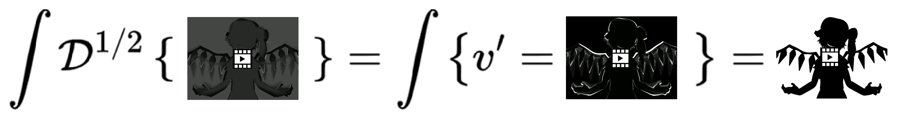

# ndvdt

The idea does feel very silly



Practically however, computing the nth-derivative of a video allows decoding
motion.

And if decoding motion isn't enough, you can also "see" half-motions or even
arbitrary fractional motions (not to be confused with the video motion's motion
which is the 2nd-derivative).

# Usage

```bash
python -m venv .venv
pip install -r requirements.txt

# Full derivative (higher precision)
python src/dvdt.py source.mp4 output.mp4

# More general, works with fractional derivatives (even pi!)
# For more info, see https://www.sciencedirect.com/science/article/pii/S0898122111002173
python src/ndvdt.py --nth 0.5 source.mp4 output.mp4

# Higher history for higher precision for the weight coefficients
python src/ndvdt.py --nth 3.141592 --history 24 source.mp4 output.mp4
```

## Sanity checks

You could be tempted to do experiments like

```bash
# First go mid-way
python src/ndvdt.py --nth 0.5 original.mp4 half.mp4

# then run again
python src/ndvdt.py --nth 0.5 half.mp4 expected_to_be_full.mp4

# and then compare it to
python src/dvdt.py original.mp4 canon_full.mp4
```

The result would still be pretty close!

But keep in mind that we lose precision in the output video (for example colors
cannot be negative so we have to clamp, we lose precision).
